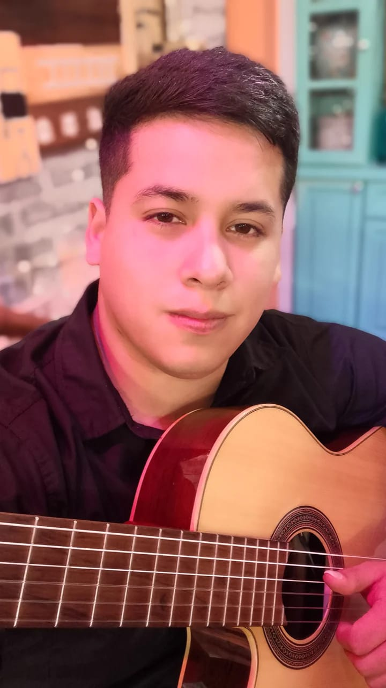

Bienvenidos a
# Programación con objetos I
Hola! Mi nombre es **Gastón Arevalo**. Soy estudiante de la UNAHUR y Guitarrista.
Estoy viviendo actualmente en Hurlingham y este es mi tercer de la carrera.

## Links importantes :monocle_face:
- [x] [Página principal](https://obj1-unahur.github.io/) de la materia (no olviden entrar seguido!) 
- [x] [Cronograma](https://docs.google.com/spreadsheets/d/1Ik6coqFm2lr2m6EFBGo3Ul4Bi4RPhrrtMQLbK3WcbIQ/edit?usp=sharing) de clases.
- [x] [Matricularse](https://discord.gg/tqyHtPt) y ver el canal de Discord.
- [x] [Mumuki](https://mumuki.io/unahur-obj1)

### Referencias Markdown 
* [Wikipedia](https://es.wikipedia.org/wiki/Markdown)
* [Guía Rápida](https://greg.schueler.us/doc/markdown.txt) de la sintaxis _(en inglés)_
* [Emojis!](https://github.com/ikatyang/emoji-cheat-sheet/blob/master/README.md) :sunglasses:

### Presentacion Personal

Me llamo ...

Me gusta ...

Me dedico a / Trabajo de ...

Les dejo una imagen mía 

